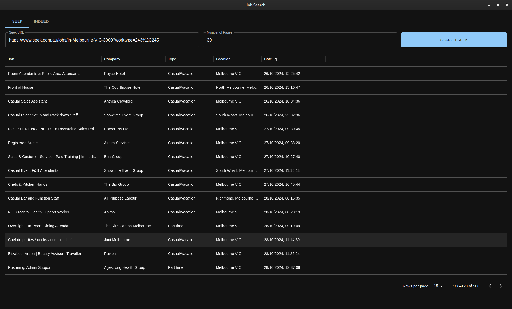

<div align="center">
  <h1>Seek Indeed GUI</h1>
  <p>Save time browsing jobs;<br>Displays results from <i>seek.com.au</i> and <i>au.indeed.com</i> in an interactive table!</p>
  
</div>

### Features
- **Self contained:** Scrapes jobs from both Seek and Indeed using built-in `chromedriver` and `electron`
- **Compact:** Results are displayed in a multi page table with customisation options
- **Organised:** Apply sorting and filtering using MUI's interactive `<DataGrid>` component

### Installing
- For now you will need to build the executable yourself (see below)

### Building/Testing

- Install these dependencies:
  + [Bun](https://bun.sh/docs/installation)
  + [Node.js](https://nodejs.org/en/download/prebuilt-installer)

```sh
# Install required dependencies from NPM
bun install

# Run the development server to test
bun run dev

# Build the executable to "/dist" output directory
bun run build
```